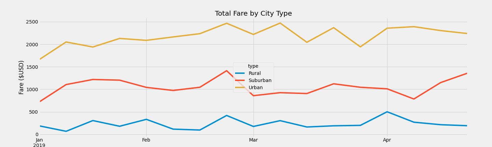
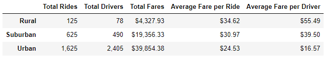

# PyBer_Analysis
Module 5 PyBer Analysis

## Overview of the PyBer Analysis Project
The purpose of the PyBer Analysis project is to visualize the total weekly fares by each city type via a multiple-line graph by utilizing Pandas and Matplotlib. The analysis will also include review of average fare per ride and average fare per driver. 

## Results
The results of this analysis demonstrate the following key findings: 

- The urban city type had the most fares from January thru April. Suburban had the next highest total fares and rural cities had the lowest overall total fares. 

- Rural cities had the lowest numbers of total rides and total drivers. Suburban cities was in the middle and urban cities had the most rides, drivers, and fares. 
- The average fare per ride was highest in rural areas and lowest in urban areas. 
- The average fare per driver was also highest in rural areas and lowest in urban areas. 

## Summary 
Based on the results of this analysis, my business recommendations are as follows: 
- Due to high average fares per driver in rural areas suggesting a significant demand, I recommend increasing the amount of drivers in those areas to make the service more affordable. 
- Urban areas had a significantly higher proportion of drivers per rides, so I would recommend decreasing the amount of drviers in those areas to ensure those drivers stay busy and profitable.
- Offer promotions or discounts to customers in rural cities in an effort to increase demand, especially once additional drivers are onboard.

